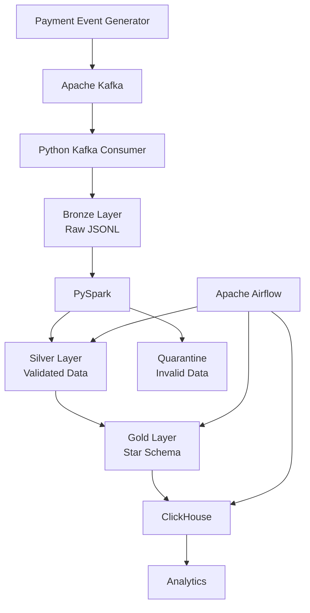

# Real-Time Fintech Data Platform

## Overview
A containerised data engineering platform that ingests payment events through Kafka, processes and validates data using PySpark, models analytical data using a Medallion architecture and star schema, and serves the resulting datasets through ClickHouse. Airflow orchestrates the end-to-end pipeline.

## Architecture

## Technology Stack
Python - event generation, Kafka ingestion and pipeline utilities
Apache Kafka - event streaming and ingestion
PySpark - distributed data processing and transformation
Apache Airflow - workflow orchestration, dependencies and retries
ClickHouse - analytical OLAP database
Docker / Docker Compose - containerised local infrastructure
SQL - transformation and analytical querying
Parquet - columnar storage for processed datasets

## Medallion Architecture

### Bronze
The Bronze layer preserves the raw events received from Kafka.

### Silver
PySpark transforms Bronze data into a validated dataset.

Data-quality rules currently check:

Missing customer IDs
Missing merchant IDs
Null or non-positive transaction amounts
Invalid currencies

Invalid records are moved into a quarantine dataset with a rejection reason.

### Gold
The Gold layer converts the validated Silver dataset into an analytical star schema.

## Data Quality
Data quality is handled as part of the Silver transformation rather than allowing invalid data to flow directly into the analytical layer.

The pipeline currently identifies:

Missing customer identifiers
Missing merchant identifiers
Invalid transaction amounts
Invalid currencies
Duplicate event IDs

Invalid records are retained in a quarantine dataset together with the reason for rejection.

This provides a foundation for monitoring data quality without silently discarding bad records.

## Data Modelling
The model contains:

fact_payment

Transaction-level fact table containing:

event_id
customer_id
merchant_id
date_key
amount
currency
timestamp
dim_customer

Customer dimension containing:

customer_key
customer_id
dim_merchant

Merchant dimension containing:

merchant_key
merchant_id
dim_date

Date dimension containing:

date_key
date
year
month
day
day_of_week

The model separates transactional facts from descriptive dimensions, making common analytical queries easier to structure.

## Idempotency and Reliability
The ingestion layer uses event_id as a stable identifier for payment events.

Before writing an event to Bronze, the consumer checks whether the event ID has already been processed.

This protects the Bronze layer against duplicate delivery when using an at-least-once processing model.

Airflow tasks also use retries to provide resilience against transient task failures.

The current ClickHouse loading process uses a full-refresh strategy, while future incremental processing could introduce stronger transactional loading and CDC patterns.

## Airflow Orchestration
Airflow coordinates the pipeline using task dependencies:

run_silver
    |
    v
run_gold
    |
    v
load_clickhouse

The pipeline is configured with retries so transient failures can be retried automatically.

The Airflow environment is containerised and includes Java and PySpark so that the transformation jobs can execute within the orchestration environment.

A successful pipeline run currently completes the three tasks in sequence:

run_silver       SUCCESS
run_gold         SUCCESS
load_clickhouse  SUCCESS

## ClickHouse
ClickHouse is used as the analytical serving layer.

The fact_payment table uses the MergeTree engine and is ordered by:

(merchant_id, date_key)

This supports analytical workloads involving merchant and date-based filtering and aggregation.

The Gold Parquet datasets are loaded into ClickHouse by an Airflow task.

The current local implementation performs a full refresh:

Gold Parquet
     |
     v
TRUNCATE ClickHouse tables
     |
     v
INSERT Gold datasets

This is appropriate for the current batch-oriented MVP. An incremental production implementation could use CDC, staging tables, upserts or other incremental loading strategies.

## Running the Project
Prerequisites
Docker Desktop
Python 3
Git

# Clone the repository

git clone <repository-url>
cd realtime-fintech-data-platform

# Create pythong environment
python3 -m venv .venv
source .venv/bin/activate

# Install kafka
pip install kafka-python

# Start up the infrastructure
docker compose up -d --build

This starts:

Kafka
ClickHouse
Airflow

Generate payment events
python producer/producer.py
Run the consumer

In another terminal:

python ingestion/consumer.py

The consumer writes incoming events to the Bronze layer.

Run the Airflow pipeline

Open:

http://localhost:8080

Trigger:

fintech_data_pipeline

Airflow then executes:

Silver -> Gold -> ClickHouse

## Future Improvements
Potential production extensions include:

Incremental CDC-based processing
Schema evolution and schema registry
More sophisticated data-quality monitoring
Incremental ClickHouse loading
Partitioning and workload optimisation at larger scale
Cloud deployment
Infrastructure as Code with Terraform
CI/CD pipeline for automated testing and deployment
Monitoring and alerting

## Key Engineering Decisions
# Why Kafka?

Kafka provides a durable event-streaming layer between event producers and downstream processing. This decouples ingestion from transformation and allows consumers to process events independently.

# Why PySpark?

PySpark provides a scalable processing model for transforming large datasets. The same transformation approach can be extended from local execution to distributed Spark environments.

# Why Medallion Architecture?

Separating raw, validated and business-ready data makes the pipeline easier to reason about, debug and reprocess.

Bronze  -> raw source data
Silver  -> validated data
Gold    -> analytical data

# Why ClickHouse?

The final workload is analytical rather than transactional, with aggregations across large datasets. ClickHouse's column-oriented architecture is well suited to high-throughput analytical queries.

# Why Airflow?

Airflow separates orchestration from processing. It manages scheduling, task dependencies, retries and operational visibility while PySpark performs the actual transformations.

## Current Capabilities
Event-driven Kafka ingestion
At-least-once ingestion pattern
Idempotent Bronze writes
PySpark transformations
Medallion architecture
Data-quality validation
Quarantine handling
Duplicate detection
Star-schema modelling
Parquet-based intermediate storage
ClickHouse analytical serving
Airflow orchestration
Automatic task retries
Dockerised infrastructure
Analytical SQL